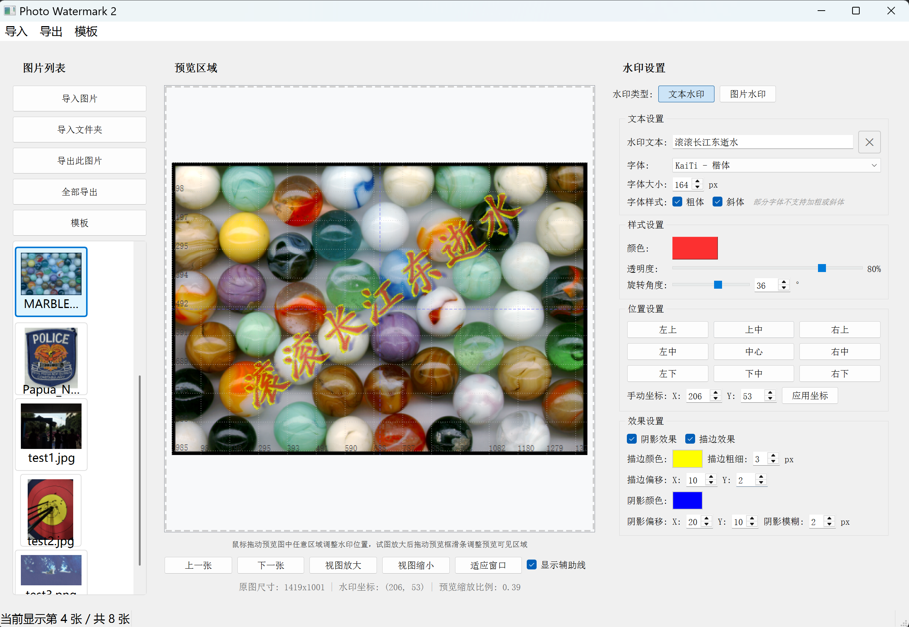
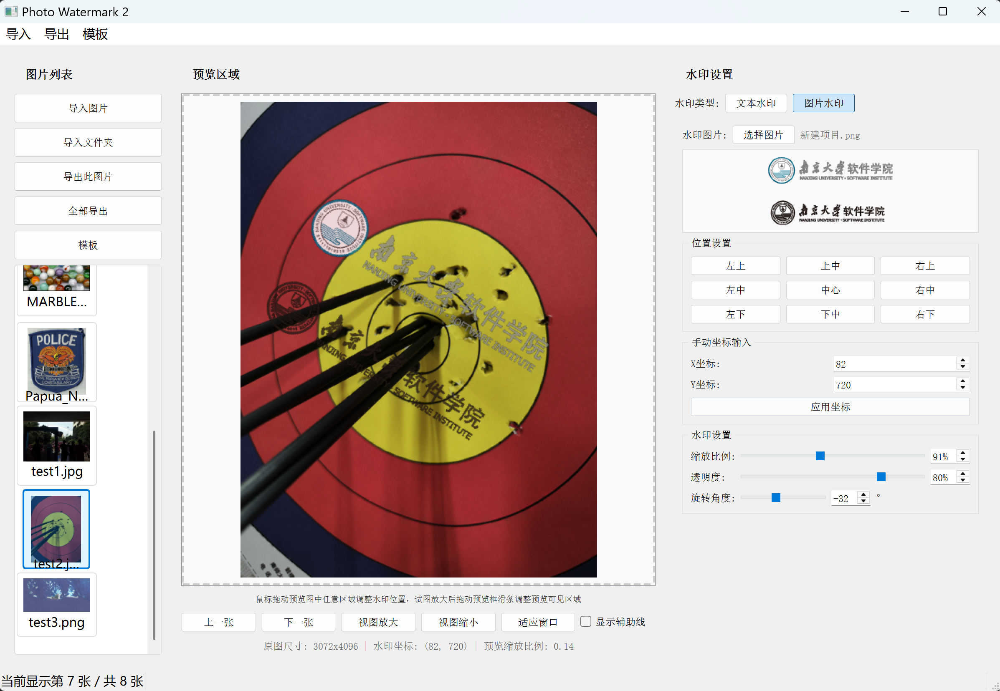

# PhotoWatermark2 for Windows


<div align="center">
  <table>
    <tr>
      <td style="padding: 10px;"></td>
      <td style="padding: 10px;"></td>
      <td style="padding: 10px;"></td>
    </tr>
  </table>
</div>

## 项目介绍
PhotoWatermark2 是一款运行在Windows平台上的功能强大、操作简便的图形化图片水印工具，专为批量添加文字和图片水印而设计。作为大语言辅助软件工程课程的第二次作业，成功实现了所有的基础要求与高级要求，并具有良好的交互体验。

## 功能特性

### 导入管理
- **多格式支持**：支持 JPG、PNG、BMP、TIFF 等多种常见图片格式
- **灵活导入**：支持单张导入、批量导入、文件夹导入，亦可拖拽导入
- **缩略图预览**：直观的图片列表展示和缩略图预览
- **信息显示**：显示图片基本信息展示

### 文本水印
- **内容自定义**：支持任意文本内容输入
- **丰富的字体设置**：
  - 支持系统已安装的几种基本中英文字体选择
  - 字号调节
  - 粗体/斜体样式切换
  - 中文字体智能加载
- **颜色与透明度**：
  - 调色板选择字体颜色
  - 0-100% 透明度调节
- **高级特效**：
  - 阴影效果（颜色、偏移、模糊度调节）
  - 描边效果（颜色、偏移、宽度调节）
- **旋转功能**：0-360度自由旋转

### 图片水印
- **图片导入**：支持从本地选择图片作为水印
- **透明通道支持**：完全支持带透明通道的 PNG 图片
- **缩放控制**：按比例缩放、自由缩放
- **透明度调节**：0-100% 透明度调节
- **旋转功能**：0-360度自由旋转

### 水印布局
- **实时预览**：
    - 主预览窗口实时显示水印效果，并与导出图片保持一致
    - 预览缩放比例默认适应窗口，并支持手动调节
    - 预览界面可选择是否显示辅助线以便于设置水印位置
    - 当图片超出预览框边界时，可通过拖动滚动条来调整图片可视区域
- **九宫格定位**：一键定位到预设位置（左上、右上、中心等9个位置）
- **拖拽调整**：支持鼠标拖拽水印到任意位置（实时预览）
- **精确坐标**：显示水印的精确坐标，并支持通过输入精确坐标设置水印位置
- **越界检测**：当水印将要超出图片边界时，发出警告提示

### 水印模板
- **模板设置**：可将当前水印设置保存为模板，包括文本水印和图片水印的布局、样式、透明度等
- **模板管理**：用户可以加载、管理和删除已保存的模板，可设置默认模板，模板路径支持自定义
- **分类存储**：文本模板和图片模板分类管理，更为直观
- **模板加载**：快速应用已保存的模板到全部图片
- **启动选项**：在启动时可选择自动加载默认模板、自动恢复到关闭前的设置、或进入模板管理界面选择其他模板

### 导出功能
- **单张导出**：导出当前编辑的图片
- **批量导出**：一次性处理并导出多张图片
- **导出路径**：用户可指定一个输出文件夹。为防止覆盖原图，会检测导出路径是否与导入路径相同，若相同则建议用户修改导出路径。
- **格式选择**：支持保留原格式、JPEG、PNG 等导出格式
- **命名规则**：支持原文件名、前缀、后缀、自定义命名等命名方式
- **JPEG 质量**：当导出为JPEG格式时，支持0-100% 质量调节
- **尺寸调整**：支持多种缩放方式（按宽度、高度、百分比缩放或自由定义尺寸）

## 系统要求
- **操作系统**：Windows 7/10/11
- **内存**：推荐 4GB 及以上
- **硬盘空间**：至少 100MB 可用空间
- **分辨率**：支持 1080p 及以上分辨率（最佳体验）

## 安装与使用

### 方法一：直接运行（推荐）
前往 [GitHub Release v1.0](https://github.com/MyXie2333/Photo-Watermark-2/releases/tag/v1.0)，下载并双击 `PhotoWatermark2.exe` 文件即可运行程序。

### 方法二：从源码运行
1. 确保已安装 Python 3.8 或更高版本
2. 安装依赖：`pip install -r requirements.txt`
3. 运行程序：`python run_app.py`

## 项目结构
```
├── .gitignore           # Git忽略配置文件
├── MARBLES.bmp          # 示例图片文件
├── README.md            # 项目文档
├── docs/                # 项目文档目录
│   ├── PRD.md           # 产品需求文档
│   └── 开发计划.md       # 开发计划文档
├── requirements.txt     # 项目依赖管理文件
├── run_app.py           # 程序运行脚本
└── src/                 # 源代码目录
    ├── ui/              # UI组件和界面
    │   ├── __init__.py  # 模块初始化文件
    │   ├── export_dialog.py  # 导出设置对话框
    │   ├── image_list_widget.py  # 图片列表组件
    │   ├── image_watermark_widget.py  # 图片水印设置组件
    │   ├── main_window.py  # 主窗口界面
    │   ├── template_manager_dialog.py  # 模板管理对话框
    │   └── text_watermark_widget.py  # 文本水印设置组件
    ├── utils/           # 工具函数目录
    ├── config_manager.py # 配置管理器
    ├── image_manager.py  # 图片管理器
    ├── main.py          # 主程序入口
    ├── watermark_renderer.py # 水印渲染器
    └── watermark_drag_manager.py # 水印拖拽管理器
```

## 技术栈
- **Python**：3.8+
- **PyQt5**：GUI框架
- **Pillow**：图像处理
- **NumPy**：数值计算

## 开发状态
当前版本：v1.0.1
更新内容：对 ui 界面和交互逻辑进行了优化。


历史版本：
v1.0.0 所有核心功能已完成开发并通过测试，可以稳定运行。

## 注意事项
对于超大图片（10MB以上）和大批量图片，加载和处理时间有所延长为正常现象，请耐心等待。

## 技术支持
如有任何问题、建议或bug报告，请联系开发者。

## 更新日志
### v1.0.0 (2025年10月11日)
- 初始版本发布
- 实现所有基础功能与高级功能

### v1.0.1 (2025年10月12日)
- 更新 ui 界面和交互逻辑
